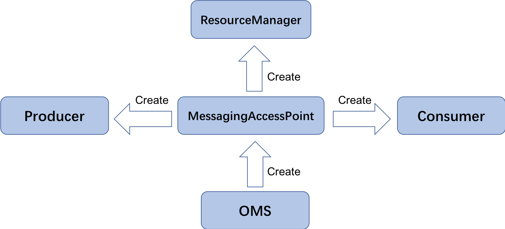

# OpenMessaging Specification

## License
## 0 Overview
### 0.1 What is OpenMessaging?
### 0.2 Why OpenMessaging?
### 0.3 OpenMessaging Terminologies
### 0.4 Difference between AMQP, COBAR & JMS

## 1 OMS Architecture
### 1.1 OMS Ecosystem
#### 1.1.1 Connector
##### 1.1.1.1 Source
##### 1.1.1.2 Sink
#### 1.1.2 Router
#### 1.1.3 Replicator

## 2 Model Components
### 2.1 Topic Pub/Sub
#### 2.1.1 Topic
   An administered object that encapsulates the identity of a message destination for pub/sub messaging.
#### 2.1.2 Publisher
   An object that sending a message to all subscribers of a topic.
#### 2.1.3 Subscriber
   An object that is used for receiving messages sent to a topic.
### 2.2 Queue
   An administered object that encapsulates the identity of a message destination.
### 2.3 Messaging Quality of Service
#### 2.3.1 Delivery Semantics
   **At least once**: a message will be consumed at least once.  
   **At most once**: a message will be consumed at most once, in this semantics, messages may be lost.  
   **Exactly once**: a message will be consumed once and only once.  
#### 2.3.2 Queue Ordering
#### 2.3.3 Durability
## 3 Message Model
### 3.1 Message Type
#### 3.1.1 Bytes Message
   A message that contains a stream of uninterpreted bytes. This message type is for literally encoding a body to match an existing message format.
#### 3.1.2 TextMessage
   A message whose body contains a java.lang.String.
### 3.2 Message Format
#### 3.2.1 System Header
   All messages support the same set of header fields, and these header fields are used by system, which are usually used for such as identify and route messages.
#### 3.2.2 User Header
   In addition to the system header, OMS provide a built-in user header for adding optional header fields to a message, and these attributes are represented as key-value forms.
#### 3.3.3 Message Body
   OMS provides two forms of message defined in the [sector 3.1](##31Message Type) and this field contains the user's business data.
### 3.3 Message System Header
#### 3.3.1 MessageId
   An unique identifier for a message.
#### 3.3.2 Topic
   An identity of a message logic destination.
#### 3.3.3 Queue
   An identity of a message physical destination.
#### 3.3.4 BornTimestamp
   The timestamp of the birth of the message. When a message is sent, this field will be set with current timestamp as the born timestamp of a message in client side.
#### 3.3.5 BornHost
   The host that generated this message. When a message is sent, this field will be set with the local host info of server.
#### 3.3.6 StoreTimestamp
   The timestamp stored by the broker. when a message is stored by server, this field will be set with current timestamp of server.
#### 3.3.7 StoreHost
   The host info of the server that stores this message. when a message is stored by server, this field will be set with the host info of server.
#### 3.3.8 StartTime
   The startup timestamp that a message can be delivered to consumer client.
#### 3.3.9 StopTime
   The stop timestamp that a message should be discarded after this timestamp.
#### 3.3.10 Timeout
   It represents a message time-to-live value. If the this field is specified as zero, that indicates the message does not expire, and this field has higher priority than START_TIME/STOP_TIME header fields.
#### 3.3.11 Priority
   OMS defines a ten level priority value with 1 as the lowest priority and 10 as the highest, and the default priority is 5. The priority beyond this region will be ignored.
   OMS does not require or provide any guarantee that the message should be delivered  in priority order strictly, but the vendor should provide a best effort to deliver expedited messages ahead of normal messages.
#### 3.3.12 Reliability
   OMS defines two modes of message delivery:  
   **PERSISTENT**: the persistent mode instructs the vendor should provide stable storage to ensure the message won't be lost.  
   **NON_PERSISTENT**: this mode does not require the message be logged to stable storage, in most cases, the memory storage is enough for better performance and lower cost.  
#### 3.3.13 SearchKey
   The keyword indexes will be built by the search keys, users can query similar messages through these indexes and have a quick response.
#### 3.3.14 ScheduleExpression
   The message will be delivered by the specified SCHEDULE_EXPRESSION, which is a [CRON expression](https://en.wikipedia.org/wiki/Cron#CRON_expression).
#### 3.3.15 TraceId
   This identifier represents a global and unique identification, to associate key events in the whole lifecycle of a message,
   like sent by who, stored at where, and received by who. And, the messaging system only plays exchange role in a distributed system in most cases,
   so the TraceID can be used to trace the whole call link with other parts in the whole system.
#### 3.3.16 CompressionLevel
   In BytesMessage, the body is just a byte array, may be compressed and uncompressed, and this field represents the message body compress level, 0 represents uncompress, 
   but vendors are free to choose the compression algorithm and define compression levels, but they must ensure that the decompressed message is delivered to the user.
## 4 OMS Interface
   The oms class provides some static methods to create a MessagingAccessPoint from the specified OMS driver url and some useful util methods.

### 4.1 MessagingAccessPoint
   An instance obtained from OMS, which is capable of creating Producer, Consumer, ResourceManager and other facility entities.
#### 4.1.1 URI Schema
   The Connection String describes the details to connect a specific OMS service provider, more details please refer to this [doc](https://github.com/openmessaging/specification/blob/master/oms_access_point_schema.md).
### 4.2 ResourceManager
   This interface is to provide a unified interface of resource management, allowing developers to manage the namespace, queue and routing resources.
### 4.3 Producer
   A simple object created by MessagingAccessPoint that is used for sending messages on behalf of MessagingAccessPoint.
### 4.4 Consumer
   A simple object created by MessagingAccessPoint that is used for receiving messages sent to a topic, and OMS provides three forms of consumer:  
   **PullConsumer**: a consumer which receives messages in using of long polling mechanism，and it also supports submit the consume result by acknowledgement. 
   **PushConsumer**: a consumer which receives messages from multiple queues, these messages are pushed from server.  
   **StreamingConsumer**: a consumer which can open multiple streams from a specified queue and then retrieve messages from them.  
### 4.5 Interceptor
#### 4.5.1 Producer Interceptor
#### 4.5.2 Producer Interceptor Points
#### 4.5.3 Consumer Interceptor
#### 4.5.4 Consumer Interceptor Points
### 4.6 Exception
## 5 Benchmark
## Appendix 
### Example of OpenMessaging API
### Change History

